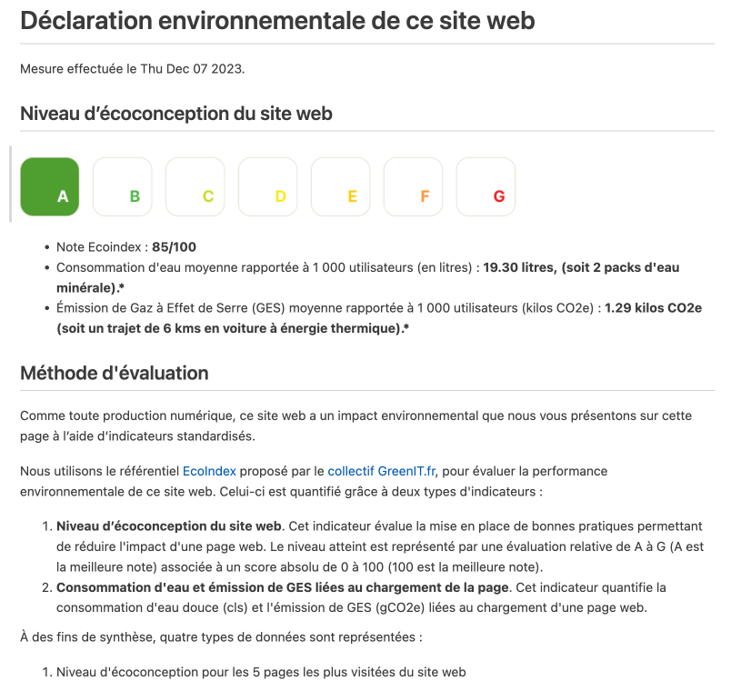
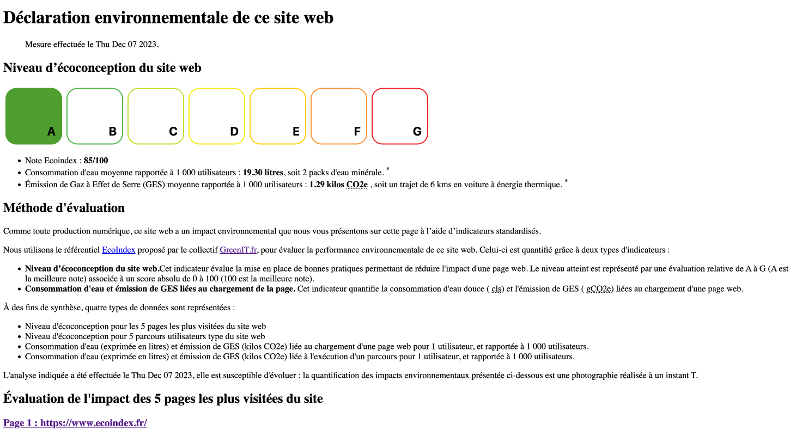

# Déclaration Environnementale, l'initiative de GreenIT.fr®

## Objectifs et principes de la déclaration d'impact

Comme toute production numérique, un site web a des impacts environnementaux qui peuvent être mesurés, affichés et réduits.

Ce projet de déclaration environnementale a vocation à établir une méthode commune pour l'évaluation des impacts des sites web sur l’environnement, et ce dans le but de créer deux effets vertueux :
* Permettre aux utilisateurs finaux de faire des arbitrages quant à leur consommation numérique, par exemple en choisissant, pour un service donné, le site web le moins impactant pour la planète.
* Aider les éditeurs de site à réduire l’impact de leur production sur l’environnement, en leur donnant les outils et méthodes pour mesurer et minimiser cet impact, ainsi qu’un référentiel commun.

!!!info Déclaration Environnementale, l'initiative de GreenIT.fr®
[!button target="blank" icon="checklist" iconAlign="right" text="Découvir"](https://declaration.greenit.fr/)
!!!

---

## Les exports proposés par l'outil `lightouse-ecoindex`

!!!info
L'export `HTML` provient du site de [Déclaration Environnementale (page gabarits)](https://declaration.greenit.fr/realiser-votre-declaration/2.-telecharger-un-gabarit-de-page). La version `Markdown` est une version adaptée de la version `HTML`.
!!!

### Version Markdown

Cette version peut-être ajoutée à votre CMS si il prend en charge le Markdown. L'ÉcoIndex est affiché sous forme image.

==- Capture d'écran de la version Markdown

===

### Version HTML

La version HTML peut-être ajouter directement à votre site web.

!!!warning
Vous pouvez adapter le style CSS à votre charte graphique, mais il est important de conserver les classes CSS pour que le rendu et les codes couleurs de l'Ecoindex soit correctement affiché.
!!!

==- Capture d'écran de la version HTML

===

### Version JSON

La version JSON est un export normalisé des données brutes de l'outil. Son objectif est d'être utilisé pour des traitements automatisés. Comme le sont des fichiers tels que `robots.txt` ou `sitemap.xml`.

==- Exemple de fichier de déclaration pour les bots `ecoindex-environmental-statement.json`

:::code source="./static/ecoindex-environmental-statement.json" :::

===

